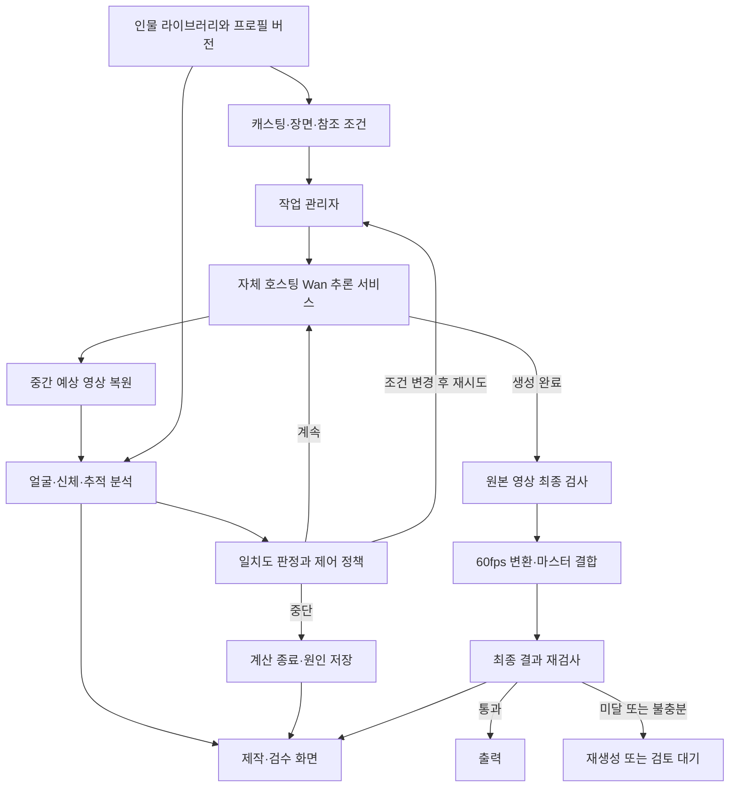

# Wan 2.x 자체 호스팅 기반 인물 일치도 감시·교정 시스템 기획서

**프로젝트:** CREZ Digital Identity Content Engine 확장  
**문서 버전:** v0.1 · 2026-09-17  
**문서 목적:** 제품 범위, 기술 검증 과제, 개발 순서와 인수 기준 확정  
**상태:** 기획 초안. 본 문서의 성능·기간·운영 수치는 별도 표시가 없으면 제안 목표이며 실측 결과가 아니다.

## 1. 사업·제품 개요

등록한 인물의 얼굴과 신체 정보를 기준으로, 자체 서버에서 생성하는 아이돌 영상의 인물 일치도를 생성 도중 반복 검사한다. 인물이 달라지거나 얼굴과 몸의 연결이 잘못되면 원인을 기록하고, 설정한 정책에 따라 교정·재시도하거나 생성을 중단한다.

제품의 핵심은 **인물 라이브러리 → 생성 조건 입력 → 중간 검사 → 판단 → 생성 제어 → 최종 검수**가 연결되는 구조다. 레퍼런스 조건화는 생성 방향을 잡는 수단이고, 별도로 개발하는 감시·제어 계층이 실제 결과를 검사한다.

자체 호스팅을 통해 모델의 입력 조건뿐 아니라 추론 코드, 중간 상태, 계산 중단과 재시도 정책까지 관리한다. 다만 생성 중간의 이미지는 완성본이 아니므로, 중간 검사만으로 최종 인물 일치를 보장하지 않는다.

### 해결하려는 문제

- 영상 초반에는 맞았던 얼굴이 회전·춤·조명 변화 이후 다른 사람처럼 변한다.
- 여러 멤버가 등장할 때 얼굴이 서로 바뀌거나 특정 얼굴이 중복된다.
- 얼굴은 유사하지만 체형이 달라지거나 얼굴과 몸의 연결이 어긋난다.
- 전체 영상 생성 후에야 실패를 발견해 시간과 GPU 계산을 반복 소모한다.
- 담당자의 육안 판단만으로는 어떤 구간에서 얼마나 이탈했는지 추적하기 어렵다.

### 제품 목표

1. 멤버별 원본 자료와 생성 결과의 비교 근거를 저장한다.
2. 생성 중 식별 가능한 시점부터 이탈을 탐지하고 작업을 중단할 수 있게 한다.
3. 실패 원인에 맞는 조건 변경과 재생성으로 최종 통과율을 높인다.
4. 검사가 불가능한 구간과 실제로 다른 인물이 생성된 구간을 구분한다.
5. 통과 영상 1초를 얻는 데 드는 총 GPU 시간과 운영자 검수 시간을 측정한다.

**기본 가정:** 이용 범위가 확보된 인물·촬영 자료를 사용하며, 첫 검증은 1인·짧은 클립으로 시작한다. 60fps는 우선 최종 납품 영상의 프레임률로 정의한다. 서버 보유 사양, 납품 해상도와 동시 작업 수는 착수 시 확정한다.

## 2. 가장 먼저 구분해야 할 세 가지 시간

### 2.1 영상 시간: 어디를 검사하는가

60fps 영상에서 5프레임 간격은 약 **83.3ms마다 한 장, 영상 1초당 12개 검사 위치**를 뜻한다. 10초 영상이라면 기본 검사 위치가 약 120개다. 이는 완성 영상 안에서의 위치다.

샘플링은 모든 프레임의 이상을 보장해서 찾아내지 못한다. 검사 위치 사이의 짧은 이탈을 줄이기 위해 의심 구간·빠른 움직임·인물 교차 구간은 검사 간격을 좁히고, 최종 출고 검사에서는 보간 후 영상까지 전 프레임 검사를 목표로 한다.

### 2.2 추론 단계: 언제 검사하는가

표준 Wan/VACE의 한 번의 생성은 영상 구간의 잠재 표현을 여러 계산 단계에 걸쳐 함께 갱신한다. 보통 완성된 1~5프레임이 먼저 확정되고 그다음 6~10프레임이 나오는 구조로 취급할 수 없다. 따라서 생성 도중 정해진 추론 단계에서 해당 구간의 **중간 예상 영상**을 얻어 검사한다. 이 구조는 공식 VACE 추론 코드에서도 확인된다. [Diffusers VACE 구현](https://github.com/huggingface/diffusers/blob/main/src/diffusers/pipelines/wan/pipeline_wan_vace.py)

예를 들어 총 40단계를 쓰는 실험에서는 16·20·24·28·32·36단계를 중간 검사 후보로 둘 수 있다. 각 시점에 같은 영상 시간 위치들을 다시 비교한다. 이 숫자는 설명용 시작값이며, 실제 검사 시점은 모델·스케줄러·노이즈 수준별 실험으로 정한다. 초반에는 얼굴 자체가 형성되지 않아 점수가 의미 없을 수 있다.

### 2.3 실제 대기 시간: 얼마나 빨리 반응하는가

83.3ms 간격으로 영상 위치를 검사한다고 해서 실제 컴퓨터도 83.3ms마다 결과를 내는 것은 아니다. 사용자의 대기 시간은 생성 단계 실행, 중간 영상 복원, 인물 분석, 판정에 걸리는 시간으로 결정된다.

대시보드에는 다음을 분리해 표시한다.

| 표시 항목 | 예시 | 의미 |
| --- | --- | --- |
| 영상 위치 | 00:02.500 | 검사 대상이 영상 안에서 등장하는 시점 |
| 생성 진행 | 24 / 40 단계 | 현재 생성 계산의 진행 위치 |
| 검사 갱신 시각 | 3초 전 | 사용자가 보고 있는 결과의 신선도 |
| 중단 상태 | 중단 요청 / 중단 완료 | 제어 요청과 실제 계산 종료의 구분 |

### 2.4 60fps 출력 정책

Wan 2.x 전체를 네이티브 60fps 모델로 가정하지 않는다. 공식 Wan2.2 TI2V-5B는 720P급·24fps 생성으로 안내된다. [Wan2.2 공식 저장소](https://github.com/Wan-Video/Wan2.2)

초기 흐름은 **모델 고유 프레임률 생성 → 원본 프레임 검사 → 60fps 보간 → 보간 결과 재검사**로 설계한다. 24fps 생성본에서 같은 약 83.3ms 간격을 검사하려면 2프레임마다 검사한다. 16fps 생성본은 전 프레임 검사를 기본 후보로 삼는다. 출력 프레임 번호와 원본 시각의 대응표를 저장하며, 중간 검사를 위해 매번 60fps 보간을 수행하지 않는다.

## 3. 모델 선택과 구현 가능 범위

### 3.1 모델 후보

| 후보 | 적용 목적 | 판단 |
| --- | --- | --- |
| Wan2.1-VACE-1.3B | 참조 이미지·포즈·마스크와 감시 루프 연결 검증 | 첫 기술검증의 기준 모델. 최종 아이돌 영상 품질 판정에는 부족할 수 있음 |
| Wan2.1-VACE-14B | 레퍼런스 기반 생성과 영상 영역 재생성 | 품질 비교를 거쳐 본 제작 후보로 평가 |
| Wan2.2 TI2V-5B / I2V-A14B | 이미지에서 시작하는 장면 생성 | VACE와 별도 후보로 성능·비용 비교 |
| Wan2.2-Animate-14B | 안무·연기 원본을 활용한 인물 애니메이션 | 원본 동작 재현이 중요할 때 비교 실험 후보 |

VACE 공식 공개 목록에는 Wan2.1 기반 1.3B·14B가 있으며, 텍스트·영상·마스크·참조 이미지를 입력할 수 있다. 해당 기능이 얼굴 일치도에 따른 자동 중단·교정을 제공한다는 뜻은 아니다. [VACE 공식 저장소](https://github.com/ali-vilab/VACE)

Wan-Animate는 인물 이미지와 구동 영상으로 동작·표정을 재현하는 접근을 제공한다. 본 기획에서는 품질 비교 후보로 다룬다. [Wan-Animate 공식 프로젝트](https://humanaigc.github.io/wan-animate/)

**선정 원칙:** Wan2.1 VACE 가중치가 임의의 Wan2.2 모델에 그대로 호환된다고 가정하지 않는다. 채택할 체크포인트·어댑터·VAE·추론 코드 조합을 고정하고 검증한다. 코드 라이선스와 실제 배포 가중치·전처리 모델의 이용 범위도 해당 조합으로 확인한다.

### 3.2 기능별 개발 범위

| 기능 | 구현 성격 | 초기 제품에서의 처리 |
| --- | --- | --- |
| 레퍼런스·포즈·마스크 입력 | 지원 모델의 기본 기능 활용 | 적용 |
| 생성 중간 상태 읽기 | 콜백 또는 추론 루프 확장 | 필수 개발 |
| 중간 영상에서 얼굴·신체 채점 | 분석 파이프라인 확장 | 필수 개발 |
| 남은 생성 계산 중단 | 중단 신호와 워커 제어 | 필수 개발 |
| 조건 변경 후 다시 생성 | 작업 제어 계층 개발 | 초기 교정 방식 |
| 실패 구간·인물 영역 재생성 | 마스크·시간 경계·조건화 연동 | 후속 개발 |
| 같은 실행 안에서 조건 강도 조절 | 모델별 추론 루프 수정·효과 검증 | 연구 기능 |
| 얼굴 점수의 미분값으로 잠재 표현 교정 | 미분 가능한 인코더·복원 경로와 샘플러 개발 | 별도 연구 기능 |

Diffusers의 WanVACEPipeline에는 단계 종료 콜백이 있다. 하지만 중간의 깨끗한 영상 추정치, 임의의 제어 변수, 인물별 교정 기능까지 모두 공개된 것은 아니다. 콜백이 있다는 사실과 원하는 폐루프가 완성돼 있다는 사실은 구분해야 한다. [Wan 파이프라인 문서](https://huggingface.co/docs/diffusers/api/pipelines/wan)

ComfyUI는 조건 입력과 결과 비교용 화면으로 활용할 수 있다. 본 제품의 감시·중단·상태 복원은 별도의 Python 추론 서비스가 담당하도록 제안한다. ComfyUI 중심으로 구현한다면 같은 책임을 수행하는 사용자 정의 샘플러·노드 개발이 필요하다.

## 4. 사용자와 핵심 사용 흐름

### 사용자 요구

- **영상 제작자:** 멤버를 선택하고 안무·의상·장면을 지정해, 인물 일치를 유지하는 영상을 얻고 싶다.
- **검수 담당자:** 문제가 발생한 멤버와 영상 위치, 기준 사진, 점수 변화와 중단 이유를 함께 보고 싶다.
- **운영자:** 실패가 명확한 작업을 종료하고 재시도 횟수와 GPU 사용량을 제한하고 싶다.
- **모델 담당자:** 어떤 조건 변경이 실제 최종 통과율을 높이는지 동일한 기준으로 비교하고 싶다.

### 사용 순서

1. 인물별 얼굴·전신 자료를 등록하고 기준 프로필을 만든다.
2. 프로젝트에 멤버를 배정하고, 원본 영상이 있으면 사람별 트랙과 멤버를 연결한다.
3. 장면·안무·의상·출력 길이를 지정한다.
4. 정책을 선택한다: `관찰만`, `이탈 시 중단`, `교정 재시도 후 중단`.
5. 생성 중 기준 사진과 중간 예상 화면, 인물별 검사 상태를 확인한다.
6. 시스템이 이탈을 감지하면 해당 구간과 이유를 표시하고 선택한 정책을 실행한다.
7. 최종 검사를 통과한 결과를 출력한다. 기준 미달 또는 판정 불가 결과는 검토 대기 상태로 남긴다.

초기 운영은 관찰만 하는 모드로 데이터를 쌓은 뒤, 검증된 조건에서 자동 중단을 켠다. 교정 연구 기능이 없어도 자동 중단 기능 자체는 독립적으로 사용할 수 있어야 한다.

## 5. 인물 라이브러리 설계

**라이브러리는 생성용 자료와 검사용 자료를 함께 관리하되 역할을 구분한다.** 얼굴 특징 벡터를 저장했다고 해서 Wan에 그대로 넣어 얼굴을 고정할 수 있는 것은 아니다. 생성에는 해당 모델이 지원하는 이미지·영상·포즈·어댑터를, 검사에는 특징 벡터와 기준 분포를 사용한다.

| 정보군 | 저장 내용 | 용도 |
| --- | --- | --- |
| 기본 프로필 | 인물 ID, 표시 이름, 프로필 버전 | 프로젝트별 멤버 고정 |
| 얼굴 원본 | 정면·좌우 사선·측면, 표정·조명별 사진 | 생성 참조, 검사 기준 |
| 얼굴 특징 | 사진별 임베딩, 품질, 각도, 대표 벡터 묶음 | 동일 인물 비교 |
| 신체 기준 | 정면·측면·후면 전신, 촬영 조건, 신뢰 가능한 비율 범위 | 체형 검사 |
| 장면 외형 | 헤어·의상·액세서리와 적용 장면 | 의도한 스타일 유지 |
| 구동 자료 | 안무 원본, 관절 궤적, 시각별 인물 배정 | 동작·위치 조건화 |
| 사용·보관 정보 | 허용 목적, 사용 기간, 원본 출처, 접근 범위 | 자산 사용과 삭제 관리 |
| 모델 이력 | 검출기·인코더·전처리·보정 버전 | 비교 결과 재현 |

### 초기 수집 가이드 — 제안치

- 인물당 얼굴 사진 15~30장, 전신 사진 6~12장, 짧은 회전·보행·춤 영상 2~3개를 출발점으로 삼는다.
- 비슷한 정면 사진만 늘리기보다 각도·조명·표정의 범위를 확보한다.
- 등록 자료에 품질 점수를 부여하고 다른 사람이 섞인 자료와 중복·과도한 보정 자료를 제외한다.
- 생성에 쓰는 자료와 성능 평가용 자료를 촬영 세션 단위로 분리한다. 동일 영상의 이웃 프레임을 양쪽에 나누어 평가하지 않는다.
- 라이브러리 사진 전체를 매번 생성기에 넣지 않고 장면에 맞는 참조 묶음을 선택한다.

키·체중·신체 치수는 사진만으로 정확히 복원되는 값으로 취급하지 않는다. 실제 측정 자료가 있으면 출처를 함께 보관하고, 영상 검사는 원근과 자세를 고려한 관측 가능 비율을 중심으로 수행한다.

## 6. 무엇을 측정하고 어떻게 판정할 것인가

### 6.1 지표를 분리한다

| 지표 | 검사 내용 | 주의점 |
| --- | --- | --- |
| 얼굴 일치도 | 등록 멤버의 얼굴 특징과 얼마나 유사한가 | 코사인 유사도는 동일인일 확률이나 ‘원본 일치율 %’가 아님 |
| 타 멤버와의 점수 차 | 본인 점수가 다른 멤버보다 충분히 높은가 | 모든 후보가 낮으면 미등록·판정 불가 가능성 |
| 신체 비율 적합도 | 비교 가능한 자세에서 체형 범위를 벗어나는가 | 원근·의상·관절 가림에 따른 오차 고려 |
| 외형 유지도 | 해당 장면의 의상·색·질감이 유지되는가 | 신체 정체성 점수와 분리 |
| 얼굴-신체 연결 | A의 얼굴이 A에게 배정한 몸·위치에 붙어 있는가 | 얼굴 점수만 높아도 연결 오류는 실패 |
| 시간적 안정성 | 시간 흐름에서 얼굴·체형이 갑자기 바뀌는가 | 처음부터 다른 얼굴로 안정적인 경우도 있으므로 원본 비교 병행 |
| 관측 품질·범위 | 얼마나 선명하게, 얼마나 많은 구간을 검사했는가 | 점수 누락을 합격으로 해석하지 않음 |

얼굴이 크게 이탈했는데 의상 점수가 높다는 이유로 종합 점수를 통과시키지 않는다. 초기 판정은 **얼굴·연결·관측 범위의 필수 조건**을 먼저 확인한 뒤 보조 지표를 사용한다. 신체 비율은 검증 데이터가 충분해질 때까지 보조 경고와 최종 검토의 근거로 사용한다.

### 6.2 얼굴 비교

1. 얼굴을 검출하고 위치·크기·각도·가림·선명도를 기록한다.
2. 기준과 동일한 정렬·전처리·인코더로 특징을 추출한다.
3. 각도와 품질이 맞는 복수 기준과 비교한다. 라이브러리 크기가 커질수록 우연한 최고점이 높아지는 효과를 보정한다.
4. 기대 멤버의 점수, 다른 멤버 최고점, 두 점수의 차를 함께 계산한다.
5. 결과를 `일치`, `이탈 의심`, `판정 불가`로 분류한다.

기존 SFace 구현을 우선 기준선으로 활용할 수 있다. SFace는 얼굴 특징을 추출·비교하는 구성요소이며, 본 시스템의 중간 영상 성능은 따로 검증해야 한다. [OpenCV SFace 공식 모델](https://github.com/opencv/opencv_zoo/tree/main/models/face_recognition_sface)

### 6.3 신체 비교

신체 검사는 `체형`, `의상 외형`, `동작`으로 나눈다. 의상이 바뀌면 외형 점수가 달라질 수 있지만 곧바로 다른 사람으로 판정해서는 안 된다.

- 1단계: 인물 영역·관절 검출을 연결하고, 관절 신뢰도와 촬영 방향이 적합할 때만 어깨/몸통·다리/몸통 등의 비율을 비교한다.
- 2단계: 자세·카메라 변화에 따른 허용 범위를 인물별로 구축한다.
- 3단계: 필요한 정확도를 확보하지 못하면 다중 시점 자료나 3D 체형 추정 도입을 별도 검토한다.

옷을 입은 단안 영상만으로 숨겨진 체형까지 정확히 검증하는 것은 초기 범위에 포함하지 않는다. 사용자 화면은 ‘체형 관측 가능’, ‘외형만 확인’, ‘신체 판정 불가’를 구분한다.

### 6.4 다중 인물의 연결

프레임마다 가장 닮은 멤버 이름을 새로 붙이면 멤버 간 얼굴 교체를 정상으로 오인할 수 있다. **장면에서 기대하는 멤버 배정과 생성 결과의 관측 신원을 따로 유지**한다.

한 시점의 사람 영역에 대해 중복 없는 배정을 수행하고, 추적·위치·얼굴 증거로 시간 연결을 유지한다. 배경 인물은 미등록으로 남길 수 있어야 한다. 교차·가림 이후에는 연결 신뢰도를 다시 평가한다. 점수가 낮은 트랙을 단순히 계산에서 제거하여 전체 통과율이 높아지지 않도록, 기대 출연 구간과 미관측 시간을 별도로 집계한다.

### 6.5 기준값 설정

처음부터 ‘0.8 이상이면 동일 인물’과 같은 공통 기준을 고정하지 않는다. 멤버별 동일인·타인 자료, 의상 변화, 촬영 세션 차이, 실제 생성 실패 사례로 임계값을 정한다.

중간 영상과 완성 영상은 분포가 다르므로 기준을 분리한다. 필요하면 추론 진행 구간·얼굴 크기·각도별 기준을 사용한다. 보정되지 않은 조합은 자동 중단을 켜지 않고 관찰 모드로 제한한다.

## 7. 생성 중 감시와 중단 정책

### 7.1 검사 실행 방식

초기에는 **검사 시점에 생성을 잠시 대기시키고 → 중간 결과를 검사하고 → 계속/중단을 결정**한다. 검사 결과가 도착하기 전에 여러 단계를 더 실행하는 문제를 피하고 실제 절감량을 측정하기 위한 방식이다.

비동기 분석은 후속 최적화로 도입한다. 이때는 검사 결과마다 작업 ID·시도 번호·체크포인트 번호를 붙이고, 이미 지난 상태에 대한 오래된 교정 명령은 실행하지 않는다. 검사 적체 시 해상도나 검사 빈도를 조정한 사실을 기록한다.

### 7.2 판정 규칙 초안

| 상황 | 처리 |
| --- | --- |
| 생성 초반이라 얼굴이 아직 형성되지 않음 | 관측만 기록, 얼굴 이탈 자동 중단 제외 |
| 충분히 선명한 얼굴에서 기준 미달이 한 번 관측됨 | 의심 표시, 해당 영상 구간 검사 강화 |
| 같은 구간에서 연속된 검사 시점에 고신뢰 이탈이 반복됨 | 현재 생성 시도 중단 또는 교정 재시도 |
| 다른 멤버로 바뀐 증거와 연결 오류가 함께 확인됨 | 우선 중단 대상으로 처리 |
| 얼굴이 가려지거나 작아 판정할 수 없음 | 판정 불가 기록, 잠깐의 가림으로 동일인 실패 확정 금지 |
| 필수 구간의 판정 불가가 오래 지속됨 | 검사 불충분 사유로 검토 대기 또는 정책상 중단 |
| 분석 서비스 오류·시간 초과 | 복구 대기 또는 기술 오류 중단, 신원 이탈로 기록하지 않음 |
| 재시도 횟수·GPU 시간·사용자 비용 한도 도달 | 추가 생성 금지, 결과와 원인 보관 |

시작 규칙은 ‘인접한 영상 샘플에서의 이탈 지속’과 ‘서로 다른 추론 검사 시점에서의 반복’을 함께 사용한다. 연속 2개 검사 시점 등의 조건은 실험값이며 통계적으로 독립된 증거라고 가정하지 않는다. 멤버 전원 평균이 아니라 **문제가 발생한 멤버·구간 단위**로 판단한다.

### 7.3 중단의 의미

중단은 이미 수행한 계산을 취소하는 기능이 아니라 **남은 생성 계산을 실행하지 않는 기능**이다. 현재 실행 중인 GPU 연산은 안전한 경계까지 끝날 수 있다.

중단 후에는 다음을 보관한다.

- 원인 멤버·영상 구간·검사 점수·관측 품질·미리보기
- 모델과 프로필 버전, 입력 조건, 시드, 추론 진행 위치
- 소모 GPU 시간, 취소 요청과 실제 종료 시각
- 이어서 재시도할 수 있는 정책 정보

현재 구간이 중단됐다고 해서 그 구간의 앞부분이 완성·합격한 것은 아니다. 이전에 별도로 생성하고 최종 검수까지 마친 구간만 승인 상태로 유지한다. 취소 후 자동으로 복원된 미완성 영상이 반환돼도 성공 결과로 등록하지 않는다.

## 8. 교정 전략: 세 단계로 개발한다

### A. 조건 변경 후 재생성 — 초기 버전

현재 시도를 중단하고, 같은 구간에 대해 실패 원인에 맞는 조건을 바꿔 새 시도를 실행한다.

| 실패 유형 | 우선 교정 후보 |
| --- | --- |
| 얼굴의 지속적 이탈 | 장면 각도에 맞는 참조 교체, 검증된 범위의 참조 강도 조정 |
| 멤버 간 혼동 | 멤버별 배정·참조 확인, 인물 수나 구간 길이를 줄인 재생성 |
| 체형·동작 왜곡 | 전신 참조와 포즈 조건 재설정, 프레이밍 조정 |
| 일부 구간의 급격한 변화 | 문제 구간을 포함해 장면 재분할 |
| 판정 불가가 많은 얼굴 | 얼굴 크기·조명·카메라 구도를 조정한 시도 |

참조 강도를 높이면 항상 얼굴이 좋아진다고 가정하지 않는다. 강도별 얼굴 품질·동작·전체 영상 품질을 측정해 유효 범위를 정한다. 일반 CFG 값도 ‘얼굴 고정 강도’와 동일하게 취급하지 않는다.

기본 재시도 한도 제안은 **최초 생성 1회 + 추가 재시도 최대 2회**다. 동일 설정 반복을 금지하고, 개선이 없거나 더 나빠지면 종료한다. 기존 프로젝트의 재시도 횟수 정의와 맞춰 한 곳에서 관리한다.

### B. 구간·영역 재생성 — 후속 버전

완성된 실패 구간이 확보되면 VACE의 영상·마스크·참조 입력을 활용해 해당 인물 영역을 다시 생성하는 기능을 개발한다. 이러한 입력 방식은 VACE의 기본 작업 범위에 포함된다. [VACE 사용자 가이드](https://github.com/ali-vilab/VACE/blob/main/UserGuide.md)

수정 범위는 ‘검사한 5프레임’과 같지 않다. 시간 압축과 움직임의 연속성을 고려해 앞뒤 여유 구간을 포함한다. 구간 길이와 해상도는 채택 모델이 지원하는 값으로 맞춘다.

마스크는 인물의 움직임을 따라가며 얼굴·목·몸 경계를 포함할 수 있어야 한다. 수정 전후의 경계 구간, 다른 멤버, 동작과 배경을 재검사한다. 자동 합성 후 최종 마스터도 다시 검사한다.

### C. 동일 실행 내부의 직접 교정 — 연구 단계

중간 일치도에 따라 다음 추론 단계의 조건 강도를 조절하거나, 얼굴 손실을 이용해 잠재 표현을 수정하는 기능이다. 사용자 목표 중 가장 기술적 불확실성이 높은 부분이다.

연구 후보는 다음 순서로 비교한다.

1. 검증된 구간에서 참조 조건 강도를 조절하는 일정표 적용
2. 중간 상태에서 다른 조건으로 분기해 완성 결과 비교
3. 미분 가능한 얼굴 비교 모델을 통한 잠재 표현 교정

현재 프로젝트의 OpenCV/ONNX 얼굴 점수 경로를 그대로 역전파에 사용할 수 있다고 가정하지 않는다. 미분 교정에는 얼굴 정렬·크롭·특징 추출과 영상 복원을 잇는 미분 가능한 경로가 필요하며, 추론 전용 실행 설정과 메모리 사용 방식도 다시 설계해야 한다. 미분 기능은 모델 전체를 재학습한다는 뜻은 아니지만, 단순 점수 조회보다 계산·메모리 비용이 커질 수 있다.

점수만 높이고 표정·동작·피부 질감을 훼손할 수 있으므로, 같은 얼굴 평가기 점수만으로 연구 성공을 판정하지 않는다. 별도 평가기 또는 블라인드 육안 검수와 동작 품질을 함께 사용한다.

**중간 상태 복원 조건:** 잠재 표현 외에도 단계 위치, 스케줄러 내부 이력, 난수 상태, 조건 입력, 모델·정밀도 설정과 캐시 상태를 복원해야 한다. 복원을 지원하지 않는 조합은 처음부터 재시작한다. 임의의 5프레임만 과거 상태로 되돌리는 기능으로 약속하지 않는다.

## 9. 시스템 구조

### 구성요소의 책임

| 구성요소 | 책임 |
| --- | --- |
| 라이브러리 서비스 | 원본 자료·특징·버전·사용 범위 관리 |
| 작업 관리자 | 생성·검사·중단·재시도 상태, 한도, 중복 실행 방지 |
| Wan 추론 서비스 | 모델 실행, 검사 경계, 중간 상태 제공, 제어 명령 적용 |
| 중간 복원기 | 현재 생성 상태를 검사 가능한 영상으로 변환 |
| 분석 서비스 | 인물 검출·추적, 얼굴·신체 점수, 관측 품질 산출 |
| 판정 엔진 | 기준 적용, 이탈 구간 확정, 다음 행동 선택 |
| 이벤트 저장소 | 단계별 점수·제어·GPU 시간의 이력 보관 |
| 제작 화면 | 기준/생성 비교, 멤버별 타임라인, 중단·재시도 이유 표시 |

샘플링·중단은 추론 워커 가까이에서 처리하고, 제품의 판정 규칙은 버전이 있는 단일 정책으로 관리한다. 검사와 판정이 별도 서버를 통과하면 그 왕복 시간도 검사 비용에 포함한다.

### 중간 복원기의 개발 주의점

- 현재 노이즈가 남은 잠재 표현을 바로 복원한 영상과, 모델이 예측한 깨끗한 결과 추정 영상을 구분한다.
- 추정 결과를 만들 때 입력 잠재 표현·예측값·스케줄러 시점이 서로 맞아야 한다. 이전 시점 예측값을 갱신된 잠재 표현과 혼합하지 않는다.
- VACE 참조용 잠재 슬롯을 실제 영상 프레임으로 검사하지 않는다.
- 시간 방향 VAE 문맥을 유지한다. 잠재 텐서를 임의로 5프레임씩 자르면 올바른 중간 영상이 나온다고 가정하지 않는다.
- 초기에는 문맥을 보존하는 복원을 우선 검증하고, 이후 선택 구간·타일·해상도 최적화를 수행한다.
- 모니터링 해상도가 너무 낮아 얼굴이 사라지면 원본 해상도 재검사 또는 판정 불가로 처리한다.

위 항목은 이 프로젝트의 구현 설계다. 공식 콜백만으로 충분한지, 추론 루프 안의 예측 직후 지점을 확장해야 하는지는 선택 버전의 코드로 확인한다.

## 10. 현재 Digital-Identity 프로젝트와의 연결

2026-09-17 현재 저장소의 관련 코드를 읽어 확인한 확장 지점이다. 이번 기획 작업에서는 런타임 성능이나 배포 상태를 검증하지 않았다.

| 현재 자산 | 확인한 내용 | 이번 확장 |
| --- | --- | --- |
| Identity·프로필 관리 | 인물 등록, 참조 집계, 프로필 버전 구조 | 생성용 참조와 검사 기준의 역할 구분, 단계별 보정 정보 |
| 얼굴·영상 QC | 생성 영상의 얼굴·신체 채점과 시계열 분석 코드 | 완성 파일 이외에 중간 프레임 묶음 입력 지원 |
| 신체 외형 인코더 | 색·질감 기반 신체 영역 비교 | 체형 비율·관절 검사 별도 구현 |
| 인물 추적·배정 | IoU 기반 추적과 배정·마진 판정 코드 | 멤버 교차·가림·미등록 처리와 기대 배정 유지 검증 |
| 규칙·재생성 엔진 | 이탈 탐지와 조건 변경·재분할 전략 코드 | 중간 검사 정책, 검사 불충분 상태, Wan별 실제 조정 항목 연결 |
| 생성 제공자 인터페이스 | SELF_HOSTED 유형과 제출·조회·취소 계약 | Wan 전용 실행 서비스, 중간 이벤트와 제어 계약 추가 |
| 작업 큐·웹 화면 | 생성·QC·재생성 흐름 | 중간 미리보기·인물별 변화·실제 중단 확인 |

특히 현재 신체 인코더는 옷 색과 질감의 영향을 받으며, 확인한 신체 임베딩 경로는 실제 결과에서 신체 비율을 `None`으로 반환한다. 따라서 현재 기능을 ‘원본과 체형까지 실시간 검증 완료’로 설명해서는 안 된다.

주요 확인 파일:

- [프로젝트 README](/Users/larry.kim/Desktop/Digital-Identity/README.md)
- [생성 제공자 계약](/Users/larry.kim/Desktop/Digital-Identity/packages/providers/src/types.ts)
- [영상 QC](/Users/larry.kim/Desktop/Digital-Identity/services/ml/app/services/qc.py)
- [신체 외형 인코더](/Users/larry.kim/Desktop/Digital-Identity/services/ml/app/encoders/body_appearance.py)
- [신체 분석](/Users/larry.kim/Desktop/Digital-Identity/services/ml/app/services/body.py)
- [재생성 전략](/Users/larry.kim/Desktop/Digital-Identity/packages/engine/src/regeneration.ts)

### 새로 필요한 데이터 계약

| 계약 | 필수 정보 |
| --- | --- |
| 검사 정책 | 영상 시간 간격, 추론 검사 일정, 관측 품질 기준, 중단·재시도 한도, 버전 |
| 검사 이벤트 | 작업·시도·검사 번호, 단계/노이즈 위치, 영상 시각, 기대 멤버, 관측 트랙, 지표, 판정 불가 사유 |
| 제어 명령 | 계속·중단·재시도 유형, 근거 이벤트, 중복 방지 ID, 적용 확인 |
| 생성 상태 | 모델·VAE·스케줄러·코드 버전, 시드, 프로필·정책 버전, 진행 상태 |
| 비용 기록 | 생성·복원·분석·재시도별 GPU 시간, 최대 메모리, 통과 영상 길이 |

기존 `submit → poll → result` 계약은 유지할 수 있으나, 이것만으로 같은 실행 안의 참조 강도 변경과 중간 상태 복원이 구현되는 것은 아니다. 중간 제어 기능은 모델별 지원 여부를 명시한다.

## 11. 우선순위와 인수 기준

### P0 — 첫 동작 제품

| 요구사항 | 인수 기준 |
| --- | --- |
| 1인 프로필 기반 자체 생성 | 고정된 Wan/VACE 조합으로 참조와 생성 결과의 연결 이력을 저장 |
| 생성 중 검사 | 생성 종료 전 두 번 이상 검사 이벤트가 발생하고 영상 위치·추론 단계가 모두 기록됨 |
| 5프레임 간격의 의미 구현 | 60fps 기준 83.3ms 간격을 원본 시간축에 대응시키고 실제 검사 위치를 기록 |
| 얼굴·외형·관측 지표 분리 | 얼굴 점수 누락이 0점 또는 합격으로 치환되지 않음 |
| 중단과 해제 | 중단 판단 후 다음 안전한 제어 경계에서 추가 모델 단계를 실행하지 않고 결과를 실패/중단으로 보관 |
| 관찰 모드 | 동일 검사 기록을 남기면서 생성에는 개입하지 않음 |
| 조건 변경 재시도 | 입력 변경 이력과 시도 한도를 지키며 새로운 시도 생성 |
| 최종 검수 | 중간 통과만으로 출력되지 않으며 원본·보간·결합 후 최종 검사가 필요 |
| 기술 오류 처리 | 메모리 부족·분석 실패·취소를 인물 이탈과 구분하고 중복 작업을 방지 |
| 제작 화면 | 문제 멤버·구간·기준 자료·원인·실제 중단 여부를 확인 가능 |

### P1 — 제작 품질과 다중 인물

- 2인 동시 출연·교차·가림 후 재등장의 배정 오류를 검증한다.
- 관측 가능한 신체 비율을 실제로 산출하고 인물별 기준 범위와 비교한다.
- 시간에 따라 움직이는 마스크를 활용한 영역 재생성과 경계 검수를 지원한다.
- 인물 수·길이·해상도를 늘리면서 통과율과 통과 영상당 비용을 측정한다.

### P2 — 연구 기능

- 동일 실행 내부의 동적 조건 강도 조절과 중간 상태 분기
- 미분 기반 얼굴·체형 가이던스
- 멤버 수가 많은 군무에서 인물별 독립 제어
- 스트리밍·자기회귀 영상 생성과의 결합

초기 범위에는 실시간 60fps 생성 속도 보장, 모든 각도에서의 정확한 신체 치수 복원, 모든 프레임에서의 동일인 보장, 완성되지 않은 일부 프레임만 확정하는 기능을 포함하지 않는다.

## 12. 검증 계획과 성공 지표

### 12.1 먼저 비교할 네 가지 방식

| 실험 | 방식 | 검증 목적 |
| --- | --- | --- |
| A | 참조 조건화 + 생성 완료 후 QC | 기준 통과율·비용 |
| B | A + 중간 검사만 수행 | 중간 점수의 예측력과 검사 비용 |
| C | A + 중간 검사·자동 중단 | 잘못된 중단과 실제 GPU 절감 |
| D | C + 조건 변경 재생성 | 재시도 비용을 포함한 최종 통과율 |

같은 원본·프롬프트·시드·모델 설정의 묶음으로 비교한다. B에서는 실패가 의심돼도 끝까지 생성해, 중간의 나쁜 점수가 최종에 자연스럽게 회복되는 비율을 확인한다. 이 데이터 없이 자동 중단 기준부터 정하지 않는다.

### 12.2 데이터 구성

첫 작동 확인에는 이용 가능한 2~3명의 자료를 사용할 수 있다. 인물 간 구분 성능을 판단하는 보정·평가 단계는 10~20명을 시작 목표로 확대하고, 비슷한 외형의 멤버·같은 의상·다른 의상을 포함한다. 이는 초기 규모 제안이며 상용 성능 보증용 표본 수가 아니다.

필수 장면은 정면 클로즈업, 측면 회전, 전신 춤, 빠른 동작, 조명 변화, 손·머리카락 가림, 원거리 얼굴, 2인 교차다. 촬영 세션·원본 클립 단위로 평가 자료를 분리하고, 임계값 선택에 사용하지 않은 자료로 최종 평가한다.

### 12.3 초기 목표 — PoC 후 조정

| 지표 | 정의 | 제안 목표 |
| --- | --- | --- |
| 잘못된 중단률 | 최종적으로 통과할 생성 중 중간 정책이 중단시킬 비율 | 5% 이하 |
| 실패 사전 탐지율 | 최종 인물 실패 중 마지막 단계 전에 이탈을 잡는 비율 | 80% 이상 |
| 검사 추가 비용 | 중간 검사를 켠 총 GPU 시간의 기준 대비 증가 | 25% 이내를 목표로 측정 |
| 통과 영상당 비용 | 모든 실패·검사·재시도 GPU 시간 / 최종 통과 영상 초 | 기존 대비 15% 이상 개선 목표 |
| 최종 얼굴 이탈 | 육안으로 확인된 이탈 구간이 남은 최종 결과 비율 | 기준 방식 대비 30% 이상 감소 목표 |
| 관측 범위 | 사전에 정한 얼굴 확인 가능 구간 중 유효 검사 비율 | 90% 이상, 나머지는 명시적으로 검토 |
| 중단 정확성 | 중단 확정 후 제어 경계를 지난 추가 모델 단계 수 | 0단계 |

위 수치는 달성된 성능이 아니다. 특히 실패 사전 탐지율은 마지막 직전 탐지로도 높아질 수 있으므로 **탐지 단계와 실제 절감 GPU 시간**을 함께 보고한다. 표본 수·인물별 결과·신뢰구간을 함께 제시하고, 상관된 프레임 수를 독립 표본 수로 세지 않는다.

최종 판정은 얼굴 지표뿐 아니라 동작 자연스러움·깜빡임·얼굴-몸 연결에 대한 블라인드 검수를 포함한다. 검사 모델 점수만 올리는 교정은 성공으로 인정하지 않는다.

### 12.4 반드시 통과할 시나리오

1. 정상적인 측면 회전·일시 가림을 인물 교체로 확정하지 않는다.
2. 다른 멤버 얼굴이 생성되면 멤버 이름을 재배정해 오류를 숨기지 않는다.
3. 얼굴은 맞아도 잘못된 몸에 연결되면 통과하지 않는다.
4. 분석 불가 구간이 많아도 남은 좋은 프레임 평균만으로 통과하지 않는다.
5. 보간 후 얼굴이 변형되면 최종 출력이 검토 대기로 이동한다.
6. 중단된 작업의 늦게 도착한 결과가 성공 상태를 덮어쓰지 않는다.
7. 재시도 한도와 GPU 시간 한도가 실제 추론 서비스에서 지켜진다.

## 13. 인프라와 비용 설계

### 실행 환경

모델 서버는 Linux·NVIDIA CUDA 환경을 기준으로 계획하고, 현재 데스크톱은 제품 화면과 관리·개발에 사용할 수 있도록 분리한다. 실제 보유 하드웨어의 적합성은 별도 확인한다.

| 목적 | 계획 기준 | 해석 |
| --- | --- | --- |
| 소형 모델·제어 코드 실험 | 가용 GPU에서 1.3B와 작은 해상도부터 측정 | 얼굴 품질과 운영 처리량을 보장하는 구성 아님 |
| Wan2.2 TI2V-5B 실행 참고 | 공식 특정 명령은 24GB VRAM과 CPU 오프로딩 등을 안내 | 중간 복원·분석까지 포함한 본 시스템 최소 사양과 다름 |
| 14B급 품질 평가 | 48~80GB급 또는 적절한 분산·오프로딩 환경을 후보로 실측 | 모든 VACE 설정이 48GB에서 실행된다는 의미 아님 |
| 운영 환경 | 생성 GPU와 분석 GPU/CPU 자원 분리 여부 비교 | 동시 미리보기 복원 시 최대 메모리 포함 측정 |

Wan2.2 공식 안내에서 T2V/I2V A14B의 특정 단일 GPU 명령은 최소 80GB VRAM을 제시한다. 이 값을 VACE나 사용자 정의 교정 루프의 요구량으로 그대로 전용하지 않는다. [Wan2.2 실행 안내](https://github.com/Wan-Video/Wan2.2)

구매나 장기 서버 계약 전, 고정한 모델 조합에서 생성·중간 복원·분석을 함께 실행해 메모리 최고점과 처리량을 확인한다. 초기부터 GPU를 동시에 학습과 생성에 배정하지 않는다.

### 비용 계산

**총 GPU 시간 = 생성 시간 + 중간 복원·분석 시간 + 재시도 시간 + 최종 검사 시간**

**경제성 지표 = 총 GPU 시간 ÷ 실제로 최종 통과한 영상 길이**

예를 들어 10초 영상에서 12개 위치/초를 6번의 중간 검사 시점에 평가하면, 인물당 약 720개의 얼굴 비교 위치가 생긴다. 실제 영상 복원량은 VAE의 시간 문맥 때문에 이보다 클 수 있고, 출연 인원이 늘면 인물 분석량도 증가한다. 최종 검사 비용은 여기에 별도로 더한다.

중단으로 아낀 남은 계산보다 검사와 재시도에 쓴 계산이 많을 수 있다. 전체 비용이 증가하면 검사 시점·해상도·대상 구간을 조정하거나 해당 장면에서는 중간 검사를 끈다. 총비용과 함께 실패 영상의 불필요한 완성 방지 효과도 따로 기록한다.

가격은 GPU 종류·계약·지역이 정해진 뒤 산출한다. 현 단계에서 확인하지 않은 서버 가격이나 영상 생성 시간을 견적처럼 제시하지 않는다.

## 14. 개발 일정과 단계별 결정

**인력 가정:** 영상 모델/ML 엔지니어 1명, 서버·제품 엔지니어 1명, 화면·검수 지원 0.5~1명. GPU와 기준 자료가 준비돼 있고 기존 프로젝트 구조를 재사용한다는 전제의 계획 추정이다.

| 단계 | 예상 기간 | 산출물 | 다음 단계 조건 |
| --- | --- | --- | --- |
| 0. 실행·관측 검증 | 1~2주 | 고정 모델 실행, 중간 복원, 강제 중단, 메모리·시간 리포트 | 생성 완료 전에 검사 가능한 화면과 실제 중단이 확인됨 |
| 1. 관찰·기준 보정 | 2~3주 | 중간/최종 비교 데이터, 품질 게이트, 중단 기준 초안 | 잘못된 중단률과 검사 비용이 허용 범위에 접근 |
| 2. 첫 동작 제품 | 2~3주 | 자동 중단, 조건 변경 재시도, 기록·화면·최종 검사 | P0 인수 시나리오와 운영 한도 통과 |
| 3. 다중 인물·체형·영역 교정 | 추가 4~6주 | 2인 교차 검증, 체형 관측, 부분 재생성 | 최종 품질과 전체 비용 개선 확인 |
| 4. 동일 실행 직접 교정 연구 | 별도 4~8주 이상 탐색 | 동적 조건·분기·미분 교정 비교 | 기존 재생성 방식보다 품질/비용 우위가 있을 때 제품화 |

첫 동작 제품은 대략 **5~8주**, 제작용 확장은 추가 검증 결과에 따라 계획한다. 직접 교정 연구는 성공을 보장하는 납품 항목으로 묶지 않는다.

### 중간 검사가 효과 없을 때의 결정

중간 얼굴을 너무 늦게 읽을 수 있거나 잘못된 중단이 많으면, 단계를 억지로 앞당기지 않는다. 짧은 구간 생성과 구간별 최종 검수·재생성으로 운영 범위를 유지하고, 중간 감시는 관찰 기능으로 남긴다. 이 경우 ‘생성 중 신원 교정 완료’로 제품 성과를 표시하지 않는다.

문자 그대로 일정 프레임을 순서대로 확정하는 요구가 필수라면 자기회귀·스트리밍 계열을 별도 비교해야 한다. 2026년 VACE 스트리밍 변형 연구도 있지만, 해당 논문은 배치 VACE 대비 참조 충실도가 크게 떨어지는 한계를 보고한다. 따라서 본인 얼굴 유지 목적에서 곧바로 대체재로 선정하지 않는다. [Adapting VACE for Real-Time Autoregressive Video Diffusion](https://arxiv.org/abs/2602.14381)

## 15. 주요 위험과 대응

| 위험 | 영향 | 대응 |
| --- | --- | --- |
| 중간 영상이 아직 불완전함 | 정상 생성의 조기 중단 | 단계별 보정, 품질 게이트, 관찰 모드 |
| 외형 점수를 체형 일치로 오해 | 잘못된 합격·실패 | 체형·의상·동작 지표 분리 |
| 멤버 교차와 닮은 얼굴 | 인물 교체 누락 | 기대 배정 유지, 후보 간 마진, 미등록 처리 |
| 참조 강도 조절의 부작용 | 표정·동작·자연스러움 저하 | 제한 범위 탐색과 최종 품질 비교 |
| 검사 비용·메모리 과다 | 생성 속도 저하·메모리 부족 | 검사 빈도 조정, 복원 최적화, 자원 분리 |
| 모델·스케줄러 변경 | 중간 점수 기준과 복원 불일치 | 조합 버전 고정, 변경 시 재보정 |
| 부분 수정의 경계 부자연스러움 | 깜빡임·동작 단절 | 앞뒤 문맥 포함, 결합 후 전 구간 재검사 |

인물 원본과 특징 벡터는 접근을 제한하고, 운영 로그에 원본 벡터를 그대로 기록하지 않는다. 프로필의 사용 범위·기간과 삭제 정책은 기존 자산 관리 흐름에 연결한다.

## 16. 착수 시 확정할 사항

| 항목 | 초기 기획 가정 | 담당 | 언제 필요한가 |
| --- | --- | --- | --- |
| GPU·서버 | 별도 Linux 생성 서버 사용 | 인프라 | 실행 검증 전 |
| 원본 사용 범위 | 프로젝트에 등록 가능한 멤버 자료 확보 | 사업·운영 | 실제 자료 등록 전 |
| 생성 방식 | 참조 이미지 + 필요 시 안무 원본 | 제작 | 모델 비교 실험 전 |
| 동시 출연 인원 | 1인 검증 후 2인, 이후 군무 | 제작·ML | 장면 평가셋 확정 전 |
| 출력 해상도·길이 | 짧은 클립으로 시작, 60fps 최종 출력 | 제작 | 성능 시험 전 |
| 중단과 교정 우선순위 | 중단 먼저, 조건 변경 재시도 다음 | 제품 | 첫 제품 범위 확정 전 |
| 허용 오탐·검수 시간 | 문서의 제안 지표로 시작 | 제품·검수 | 자동 중단 활성화 전 |
| 신체 일치의 의미 | 관측 가능한 체형 비율 + 장면 외형 | 제작·ML | 체형 검사 개발 전 |

본 기획의 첫 개발 목표는 **등록 멤버 1명의 짧은 영상을 자체 Wan 환경에서 생성하면서 중간 일치도를 기록하고, 확인된 이탈에 대해 실제 남은 계산을 중단하며, 조건을 바꾼 재시도 결과까지 최종 검수하는 것**이다. 이 흐름의 품질과 비용을 확인한 뒤 다중 멤버와 동일 실행 내부의 직접 교정으로 확장한다.
